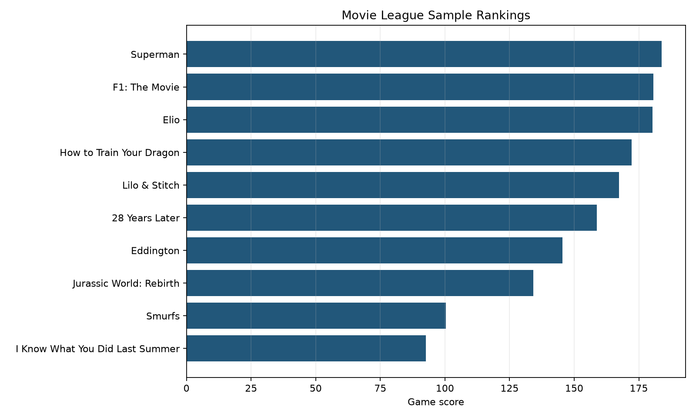

# The Movie League

Movie League is an analytics project that ranks current films by combining box-office momentum, audience reception, and critic response into a daily league table.

The original local project scraped movie signals, stored them in a Postgres workflow, and refreshed scores over time. This public version keeps the analytical core while removing local credentials, private runtime files, and large scrape artifacts.

## What This Shows

- Built a reproducible ranking function from messy entertainment data signals.
- Converted daily and cumulative box-office values into a momentum score.
- Joined box-office, audience, and critic-style fields into a single league table.
- Packaged the workflow as testable Python rather than a one-off script.
- Added documentation for scoring assumptions, source handling, and security boundaries.

## Repository Layout

```text
src/movie_league/scoring.py       Core ranking and scoring functions
examples/run_sample_league.py     Reproducible sample run
data/sample/                      Small demonstration dataset
data/processed/                   Generated sample rankings
reports/figures/                  Generated chart
docs/                             Methodology and data notes
tests/                            Unit tests for scoring logic
```

## Quickstart

```bash
python -m venv .venv
source .venv/bin/activate
pip install -r requirements.txt
PYTHONPATH=src python examples/run_sample_league.py
PYTHONPATH=src pytest
```

The sample run writes:

- `data/processed/sample_rankings.csv`
- `reports/figures/sample_league_scores.png`

## Sample Output

The included data is intentionally small: a July 20, 2025 box-office snapshot plus compact demonstration reception fields. It is enough to show the scoring behavior without publishing scrape archives or local database state.



## Scoring Summary

```text
performance_score = sqrt(daily_growth_pct) * top_10_rank_multiplier
game_score = cinema_score + critic_score + performance_score
```

See [docs/scoring_method.md](docs/scoring_method.md) for details.

## Security Note

The recovered local scripts used a local database workflow. This repository does not include those scripts verbatim because portfolio repositories should not expose credentials, local logs, database dumps, or private runtime state. See [docs/security_and_privacy.md](docs/security_and_privacy.md).

